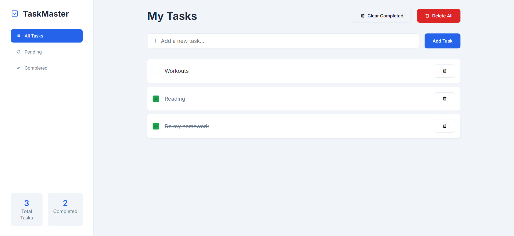

# Task Management App



## Introduction
This Task Management App is designed to help users organize their daily activities, manage priorities, and track progress efficiently. With a clean and modern interface, it is easy to use and adaptable to different needs.

## Features
- **Create Tasks**: Quickly add tasks with a user-friendly interface.
- **Prioritize**: Organize tasks by importance and urgency.
- **Progress Tracking**: Visualize task completion with a clear progress indicator.
- **Drag-and-Drop**: Seamlessly manage task lists using drag-and-drop functionality.

## Installation
1. Clone this repository:
   ```bash
   git clone https://github.com/your-username/task-management-app.git
   ```
2. Navigate to the project directory:
   ```bash
   cd task-management-app
   ```
3. Install dependencies:
   ```bash
   npm install
   ```
4. Start the application:
   ```bash
   npm start
   ```

## Usage
1. Open the app in your browser.
2. Create tasks by clicking the "Add Task" button.
3. Organize tasks by dragging and dropping them into different categories.
4. Track your progress using the progress bar.

## Technologies Used
- **Frontend**: React.js, HTML, CSS
- **Backend**: Node.js, Express
- **Database**: MongoDB

## Screenshot


## Contribution
Feel free to contribute by submitting a pull request. Ensure your code follows the project's coding standards.

## License
This project is licensed under the MIT License.
